# 设计稿：第二大脑 — 基于ReAct Agent的智能知识管理助手

**赛道：Agent 创新**

---

## 一、设计流程概述

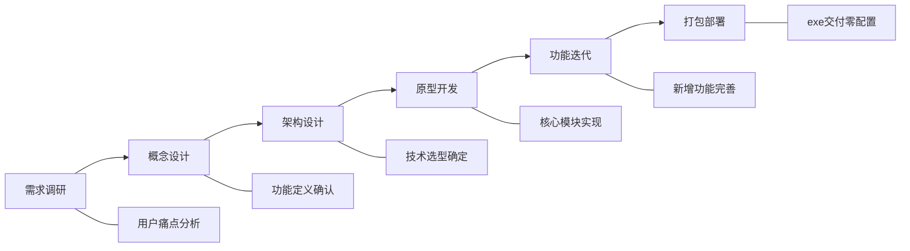

### 1.1 需求调研阶段

**核心问题**：现代知识工作者与学习者日常需从多个信息源获取知识，信息分散于不同平台与工具中，缺乏统一管理与主动提醒机制，导致知识寻找效率和利用率低、且遗忘率高。

**用户痛点分析**：
- **信息碎片化**：知识分散于笔记软件、各类文档、收藏网页、社交平台等多种渠道，缺乏系统化整合。
- **主动性缺失**：现有知识管理工具以被动存储为主，无法主动推送复习提醒，从而导致知识的遗忘。
- **关联性缺失**：不同领域知识之间的隐含联系难以被发现，无法形成结构化知识网络，无法帮助人们培养发散性思维和整合能力。

**解决方案**：构建一个具备自主决策能力的AI Agent系统，并科学利用遗忘曲线相关知识，实现知识的智能存储、智能检索、个性化复习自动提醒、定期总结以及跨领域关联发现。

---

## 二、系统架构设计

### 2.1 整体架构

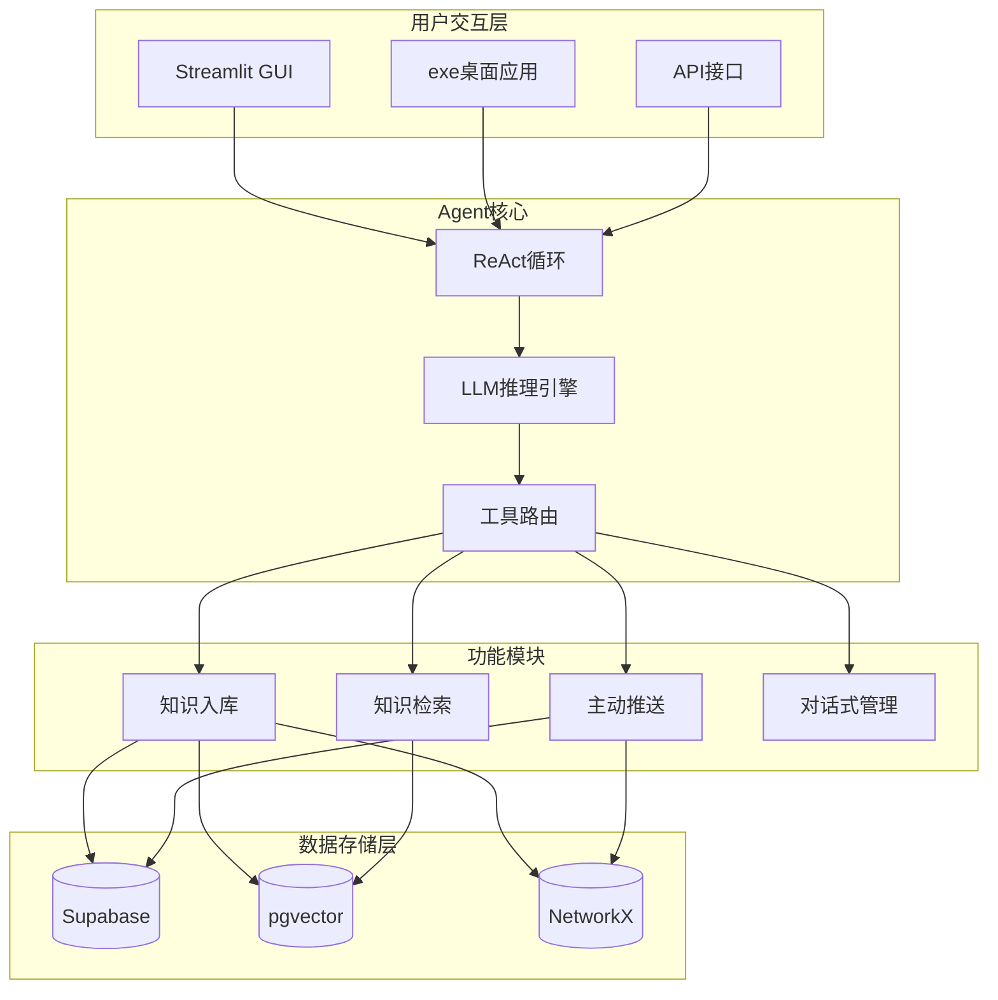

### 2.2 Agent工作流程

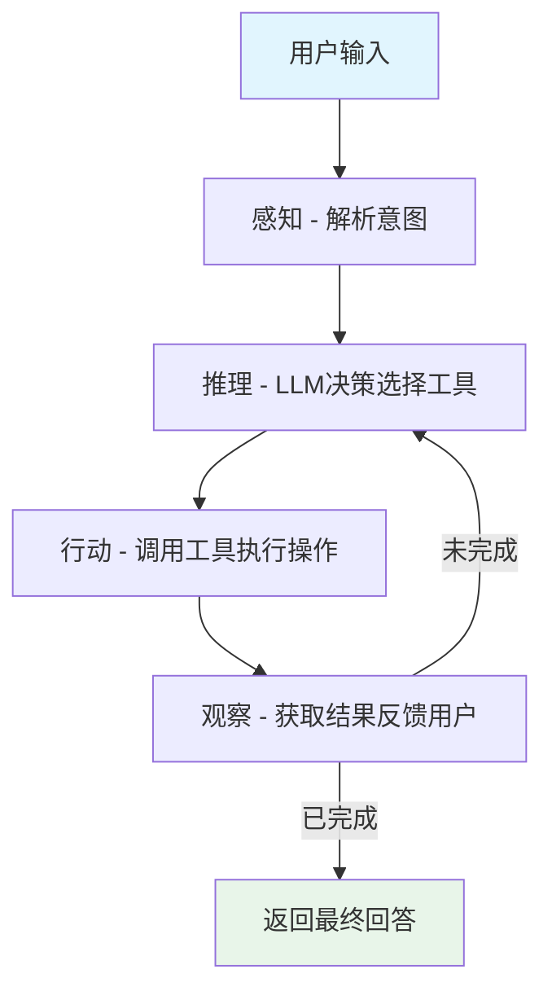

---

## 三、交互流程设计

### 3.1 核心用户流程

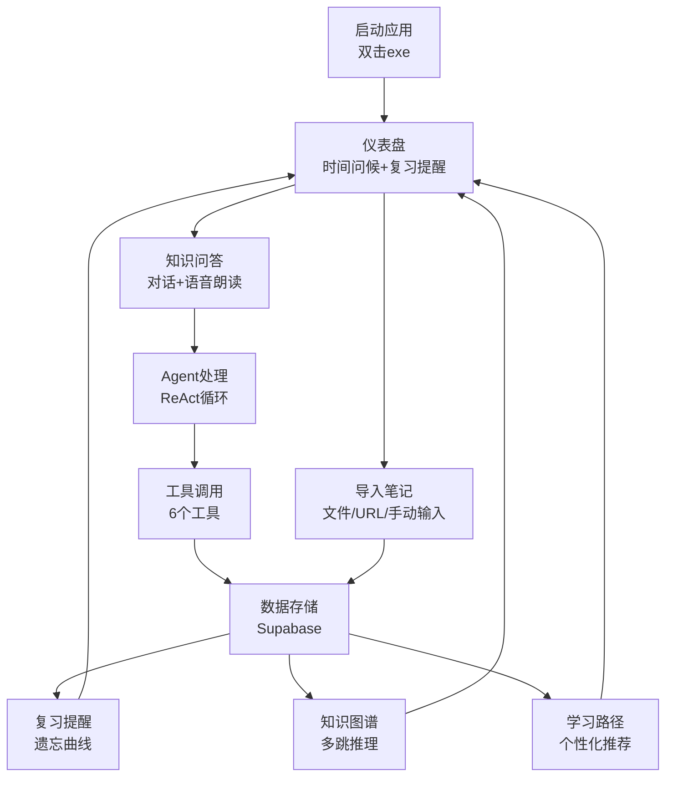

### 3.2 Agent工具调用流程

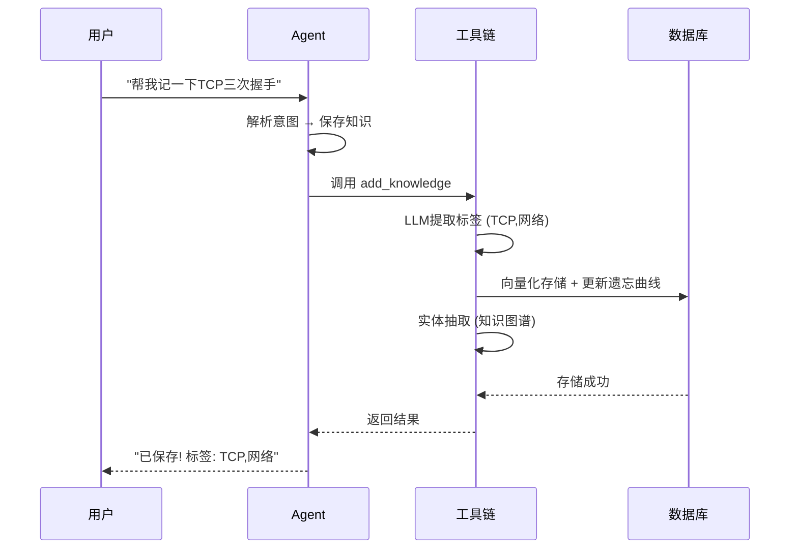

### 3.3 语音交互流程

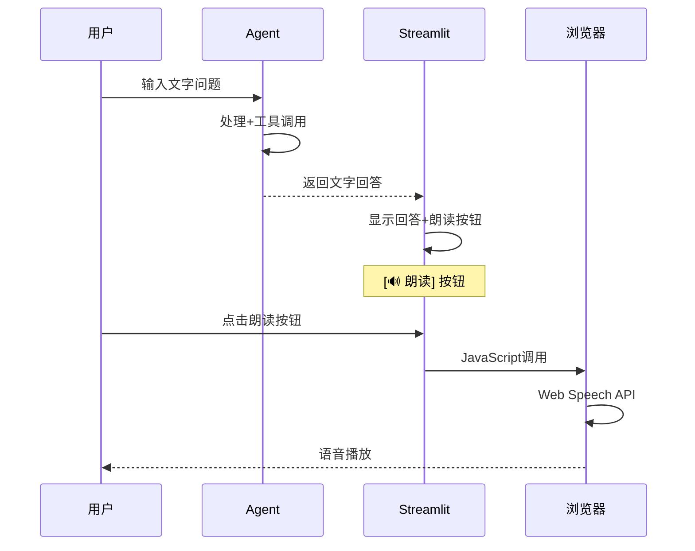

---

## 四、界面设计（最新版）

### 4.1 仪表盘（带时间问候）

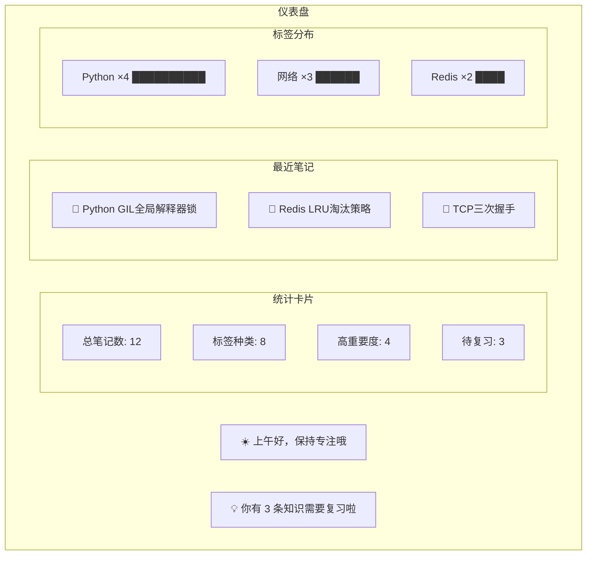

### 4.2 知识问答（带语音朗读）

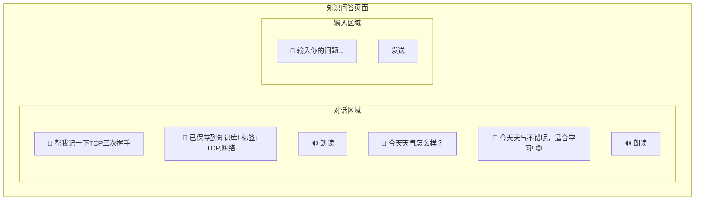

### 4.3 知识图谱（多跳推理）

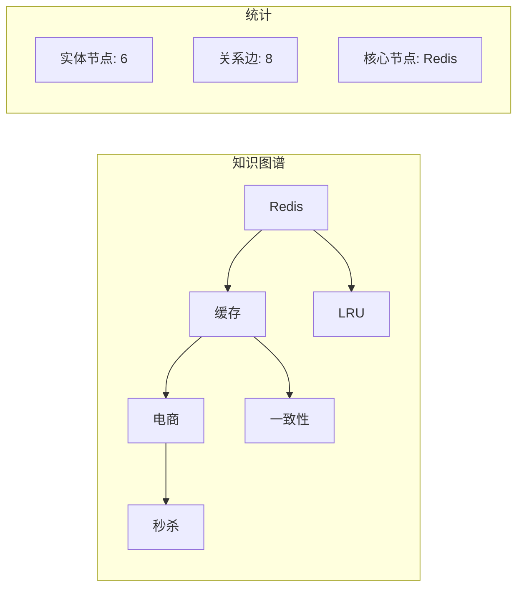

### 4.4 复习提醒（遗忘曲线）

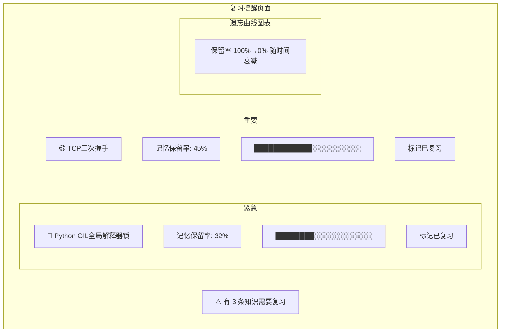

### 4.5 学习路径（个性化推荐）

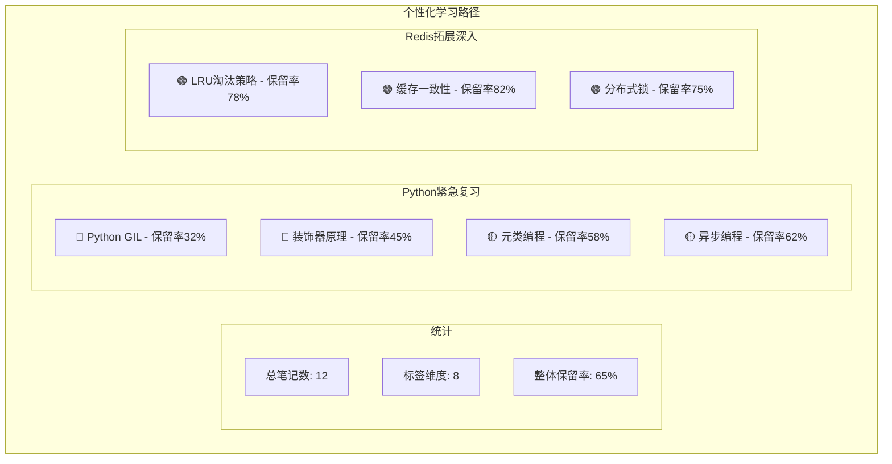

---

## 五、技术实现要点

### 5.1 核心技术栈

| 模块 | 技术选型 | 说明 |
|------|---------|------|
| AI Agent | DeepSeek v4 + ReAct循环 | 自主决策，多步推理 |
| 知识图谱 | NetworkX + LLM实体抽取 | 多跳推理，关联发现 |
| 向量检索 | Supabase pgvector | 语义搜索，相似度匹配 |
| 遗忘曲线 | SM-2算法 | 记忆保留率计算 |
| 前端界面 | Streamlit | 中文UI，可视化 |
| 桌面打包 | PyInstaller | exe双击即用 |

### 5.2 数据流设计

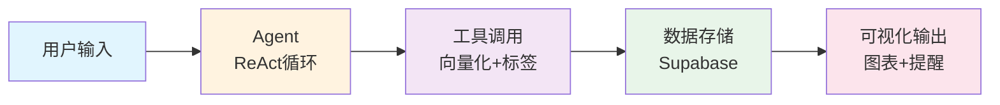

### 5.3 工具链设计

| 工具名 | 功能 | 触发场景 |
|--------|------|---------|
| add_knowledge | 保存笔记到知识库 | 用户说"记一下"、"保存" |
| search_knowledge | 语义搜索相关笔记 | 用户问"我学过XX吗" |
| manage_knowledge | 列出/删除/统计笔记 | 用户说"列出"、"删除" |
| send_reminder | 推送复习提醒 | 用户说"需要复习什么" |
| fetch_web_content | 抓取网页内容保存 | 用户给出URL链接 |
| knowledge_graph | 知识图谱查询/发现 | 用户说"图谱"、"关联" |

---

## 六、创新点对比

| 传统笔记工具 | 第二大脑 (本项目) |
|-------------|-----------------|
| 被动存储 | **主动推送**复习提醒 |
| 手动搜索 | **语义搜索** + 自动推荐 |
| 无关联 | **知识图谱**多跳推理 |
| 无遗忘追踪 | **遗忘曲线**可视化 |
| 本地文件 | **云端存储**，多端访问 |
| 手动整理 | **Agent自动**提取标签 |

---

## 七、框架搭建历程（试验）

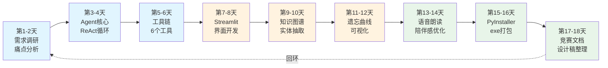

---

## 八、用户体验设计原则

### 8.1 零配置启动
- exe双击即用，无需安装Python
- .env已内置API Key，无需配置
- 3秒自动打开浏览器

### 8.2 陪伴感设计
- 时间问候（早/中/晚不同问候）
- 温暖语气（"啦"、"哦"、"呀"）
- 主动关心学习状态

### 8.3 多模态交互
- 文字对话（主交互）
- 语音朗读（Web Speech API）
- 可视化图表（知识图谱、遗忘曲线）

---

**设计完成日期：2026年7月22日**
